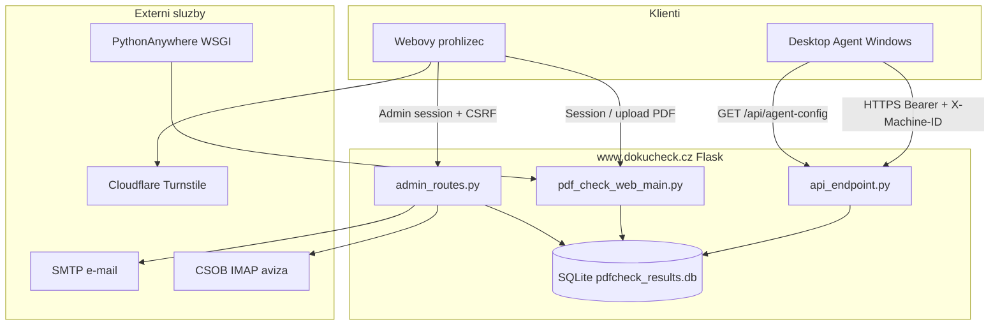

# DokuCheck – Kompletní auditní a předávací zpráva

> **Účel dokumentu:** Samostatný „context pack“ pro předání projektu jiné AI nebo vývojáři.  
> Obsahuje stav repozitáře, architekturu, funkce, provoz, rizika a praktický návod, **bez tajných hodnot** a bez runtime dat z produkční databáze.

---

## 0. Metadata snapshot (ověřeno z repozitáře)

| Položka | Hodnota |
|---------|---------|
| **Repozitář** | `PDF_CHECK_SW` (monorepo) |
| **Remote** | `https://github.com/cieslarmartin/PDF_CHECK_SW.git` |
| **Větev** | `main` (čistý working tree k datu auditu) |
| **Poslední commit** | `b32006b` – „web free tier“ (2026-08-27) |
| **Web verze** | `w26.08.096`, build **140** → `web_app/version.py` |
| **Agent verze** | `v26.02.012`, build **57** → `desktop_agent/version.py` |
| **Produkční doména (kód)** | `https://www.dokucheck.cz` |
| **Hosting (dle dokumentace)** | PythonAnywhere, Python 3.10, SQLite |
| **Datum auditu** | 2026-09-03 |
| **Metoda auditu** | Read-only průzkum zdrojového kódu a dokumentace v repozitáři |

**Hranice auditu:** Tento dokument popisuje **obsah repozitáře** a jeho záměr. Stav produkčního serveru (env proměnné, obsah DB, IMAP, SMTP) **nebyl přímo ověřen** – u provozních kroků platí „ověřit na PythonAnywhere“.

---

## 1. Executive summary

**DokuCheck** (alternativně „Projektový Strážce“) je produkt pro **projektanty a architekty** kontrolující PDF dokumentaci před podáním na **Portál stavebníka (ISSŘ)**.

Projekt má **tři hlavní části**:

1. **Desktop agent** (`desktop_agent/`) – Windows GUI aplikace (Python + CustomTkinter). Lokálně analyzuje PDF (PDF/A-3, podpisy, TSA, DocMDP/ISSŘ kompatibilita) a na server odesílá **pouze metadata**, ne celé soubory.
2. **Webová aplikace** (`web_app/`) – Flask monolit: veřejný web, `/app` pro kontrolu a zobrazení výsledků, checkout, zákaznický portál, REST API pro agenta, admin dashboard.
3. **Archiv** (`archived_signing_module/`) – legacy modul pro podepisování PDF, **není** součástí produkčního DokuCheck flow.

**Klíčový produktový princip:** V režimu „Z Agenta“ zůstávají PDF **lokálně na disku** uživatele; server dostává výsledky analýzy (JSON). Detailní výsledky kontroly se v desktop agentovi V3 **záměrně nezobrazují** – uživatel je vidí na webu.

**Aktuální produkční UI agenta:** `ui_2026_v3_enterprise.py` (ne starší `ui.py`).

---

## 2. Cílová skupina a marketingová identita

| Aspekt | Popis |
|--------|-------|
| **Produkt** | DokuCheck |
| **Cílová skupina** | Projektanti, architekti, projekční ateliéry |
| **Use case** | Kontrola PDF/A-3, elektronických podpisů, kvalifikovaných TSA a ISSŘ kompatibility (DocMDP) |
| **Jazyk** | Všechny texty v aplikaci i admin dashboardu musí být v **češtině** |
| **Právní disclaimer** | Výsledky mají informativní charakter, nenahrazují Portál stavebníka |

---

## 3. Mapa repozitáře

```
PDF_CHECK_SW/
├── web_app/                    ★ Flask web + API + admin + SQLite
│   ├── pdf_check_web_main.py   ★ Hlavní Flask app (~5100+ ř.)
│   ├── api_endpoint.py         ★ REST API pro agenta
│   ├── admin_routes.py         ★ Admin blueprint (~3500+ ř.)
│   ├── database.py             ★ SQLite schéma + business logika (~4800+ ř.)
│   ├── license_config.py       ★ Tier definice, feature flags
│   ├── feature_manager.py      ★ Runtime feature kontrola
│   ├── settings_loader.py      ★ Fallback nastavení, ceny
│   ├── csob_payments.py        ★ ČSOB IMAP platby
│   ├── email_sender.py         ★ SMTP e-maily
│   ├── invoice_generator.py    ★ PDF faktury
│   ├── csrf_protect.py         ★ CSRF ochrana HTML formulářů
│   ├── turnstile_captcha.py    ★ Cloudflare Turnstile
│   ├── wsgi_pythonanywhere.py  ★ WSGI entry point pro PA
│   ├── version.py              ★ Jediný zdroj web verze
│   ├── templates/              ★ 55 HTML šablon
│   ├── static/                 ★ CSS, JS, PWA, logo
│   ├── tests/                  ★ Fixture pro ČSOB testy
│   └── migrate_*.py            ★ Jednorázové DB migrace
│
├── desktop_agent/              ★ Windows desktop agent
│   ├── pdf_check_agent_main.py ★ Entry point, orchestrace
│   ├── pdf_checker.py          ★ Jádro analýzy PDF
│   ├── license.py              ★ API klient, config YAML
│   ├── machine_id.py           ★ X-Machine-ID (device locking)
│   ├── tsa_registry.py         ★ Whitelist TSA autorit
│   ├── ui_2026_v3_enterprise.py★ ★ PRODUKČNÍ GUI
│   ├── ui.py, ui_2026_v1/v2    ★ Legacy / preview UI
│   ├── version.py              ★ Jediný zdroj agent verze
│   ├── dokucheck.spec          ★ PyInstaller spec
│   ├── build_installer.py      ★ Build EXE + Inno Setup
│   └── store/                  ★ MSIX pro Microsoft Store
│
├── archived_signing_module/    ○ Archiv (podepisování PDF)
├── docs/                       ○ Technická dokumentace
├── local_test/                 ○ Offline test PDF enginu
├── testovaci_engine/           ○ Porovnání 3 PDF enginů
├── run_local.py                ○ Lokální spuštění webu (:8080)
├── deploy.sh                   ○ Deploy skript pro PythonAnywhere
├── requirements.txt            ○ Minimální union závislostí
└── .cursor/rules/              ○ Pravidla pro AI workflow
```

### Legenda typů souborů

| Symbol | Význam |
|--------|--------|
| ★ | Aktivní produkční kód |
| ○ | Dokumentace, testy, archiv, side projekty |
| **Ignorováno Gitem** | `web_app/*.db`, `.env`, `desktop_agent/config.yaml`, `venv/`, `dist/`, `install/`, `*.msix`, `__pycache__/` |

### Side projekty (mimo hlavní produkt)

- `autonomní mobilní aplikace pro Android/` – Flutter admin APK (nesmí do Gitu)
- `archived_signing_module/` – legacy podepisování PDF

---

## 4. Architektura systému

### 4.1 Přehled komponent



### 4.2 Tři nezávislé autentizační kontexty

| Kontext | Session / auth | Kde se používá |
|---------|----------------|----------------|
| **Agent API** | `Authorization: Bearer {api_key}` + `X-Machine-ID` | Všechny `/api/*` pro agenta |
| **Portál / App** | Flask session `portal_user` | `/portal`, `/app` |
| **Admin** | Session `admin_user` + OTP e-mailem | `/admin/*`, CSRF token |

**Poznámka:** Agent API **nepoužívá CSRF** (`csrf_protect.py` – exempt `/api/`).

### 4.3 Sdílený PDF engine

Web na PythonAnywhere importuje `desktop_agent.pdf_checker` z celého klonu repozitáře (viz `deploy.sh` kontrola importu). **Zároveň** existuje duplikovaná kopie PDF logiky v `pdf_check_web_main.py` (~800+ řádků) – riziko divergence.

---

## 5. Funkční inventář

### 5.1 Desktop Agent

| Funkce | Soubor / symbol | Popis |
|--------|-----------------|-------|
| Spuštění GUI | `PDFCheckAgent.run()` | `pdf_check_agent_main.py` |
| Kontrola 1 PDF | `check_pdf(mode='single')` | Lokální analýza |
| Kontrola více PDF | `mode='multiple'` | Batch analýza |
| Kontrola složky | `mode='folder'` | Rekurzivní scan, stromová struktura |
| Fronta + drag & drop | `PDFCheckUI_2026_V3` | `ui_2026_v3_enterprise.py` |
| Trial „Vyzkoušet zdarma“ | `_do_trial_login()` | Auto login `zdarma@trial.verze` / `free` |
| Přihlášení e-mail+heslo | `LicenseManager.login_with_password()` | POST `/api/auth/user-login` |
| Ověření API klíče | `verify_api_key()` | GET `/api/auth/verify` (UI callback existuje, V3 primárně nepoužívá) |
| Odeslání výsledků | `upload_batch()` | POST `/api/batch/upload` – jen metadata |
| Otevřít web | `_get_web_login_url()` | One-time token → `/auth/from-agent-token` |
| Update notifier | `_compute_update_state()` | Porovnání build vs `/api/agent-config` |
| Odhlášení | `clear_api_key()` | Smaže klíč z `config.yaml` |

**Workflow V3 (dvoustupňový):**
1. Přidat PDF do fronty → **Analyzovat PDF** (lokálně, `auto_send=False`)
2. **Odeslat na server** → upload batch → otevření webu s výsledky

### 5.2 Veřejný web

| Funkce | Route | Handler / šablona |
|--------|-------|-------------------|
| Landing | `/` | `index()` → `landing_preview.html` |
| VOP / GDPR | `/vop`, `/gdpr` | Texty z `global_settings` |
| Stažení agenta | `/download` | `download.html` |
| Webová kontrola | `/app`, `/online-check` | Upload PDF v prohlížeči |
| Checkout | `/checkout` | Objednávka licence, Turnstile |
| Portál zákazníka | `/portal` | Přehled licence, zařízení |
| Přihlášení z agenta | `/auth/from-agent-token` | One-time token → session |

**Režimy v `/app`:**
- **Z Agenta** – načtení batch z `/api/agent/results` (Bearer api_key)
- **Cloud / Serverová** – upload PDF na server (`/analyze`, `/analyze-batch`)

### 5.3 Admin dashboard

| Oblast | Route (výběr) | Popis |
|--------|---------------|-------|
| Přihlášení 2FA | `/login`, `/login/verify-code` | Heslo + OTP e-mailem |
| Dashboard | `/admin` | KPI, objednávky, licence |
| Licence CRUD | `/admin/users`, `/admin/api/license/*` | Správa uživatelů |
| Tarify | `/admin/tiers` | Tabulka `license_tiers` |
| Objednávky | `/admin/pending-orders` | Faktury, potvrzení platby |
| ČSOB platby | `/admin/csob-platby` | IMAP parsing, auto-párování |
| Trial správa | `/admin/trial` | Reset Machine-ID trial |
| Nastavení | `/admin/settings` | SMTP, texty, limity |
| Mobilní PWA | `/admin/m-dashboard` | Admin na mobilu |

---

## 6. End-to-end scénáře

### E2E-1: Instalace a první spuštění agenta

```
Stažení exe/msix (/download)
  → Spuštění pdf_check_agent_main.py / DokuCheckPRO.exe
  → _ensure_config_in_exe_dir() – kopie config do AppData
  → fetch_remote_config() – GET /api/agent-config
  → Splash + hlavní okno (nepřihlášen)
```

**Soubory:** `pdf_check_agent_main.py`, `license.py`, `config.example.yaml`

### E2E-2: Trial v agentovi (Machine-ID)

```
Klik „Vyzkoušet zdarma“
  → login_with_password('zdarma@trial.verze', 'free')
  → POST /api/auth/user-login → api_key (tier Trial)
  → upload_batch s hlavičkou X-Machine-ID
  → Server: trial_usage tabulka, limit trial_limit_total_files (default 10)
```

**Soubory:** `license.py:16-17`, `api_endpoint.py` (upload_batch), `database.py` (trial_usage)

### E2E-3: Placená licence – objednávka až po aktivaci

```
Landing → /checkout?tarif=basic|pro|firemni
  → Turnstile CAPTCHA
  → insert pending_orders (NEW_ORDER)
  → generate_invoice_pdf → WAITING_PAYMENT
  → Admin confirm-payment → api_keys + ACTIVE
  → Aktivační e-mail (set_password link, bez hesla v e-mailu)
  → /portal/set-password → /portal
  → Agent login → upload_batch
```

**Soubory:** `pdf_check_web_main.py` (checkout), `admin_routes.py`, `invoice_generator.py`

### E2E-4: Agent → Web (one-time token)

```
Agent POST /api/auth/one-time-login-token (Bearer)
  → DB one_time_login_tokens (120 s)
  → Browser GET /auth/from-agent-token?login_token=...
  → consume_one_time_token() → session portal_user
  → redirect /app
```

### E2E-5: Free web kontrola (bez účtu)

```
/app nebo /online-check (nepřihlášen)
  → POST /analyze-batch
  → check_web_check_file_limit(ip) – default 4 soubory/kalendářní měsíc/IP
  → Při vyčerpání: HTTP 429 + paywall → /checkout?tarif=basic
```

**Pozor:** UI `online_check.html` může uvádět starý text „3 kontroly/24h“ – backend počítá **soubory/měsíc** (viz auditní nález R7).

### E2E-6: Admin – automatická platba ČSOB

```
Cron / admin → process_csob_payments / csob_payments.py
  → IMAP mailbox, parse HTML avíza (DKIM kontrola)
  → Párování VS ↔ pending_orders.order_display_number
  → Pokud auto_activate_csob: aktivace licence
```

### E2E-7: Kontrola PDF (technický tok)

**Agent (lokálně):**
```
analyze_pdf_file(filepath)
  → pypdf PdfReader + extract_signatures_via_reader
  → byte-scan fallback pro velké soubory (>2 MB: head 512 KB + tail 1 MB)
  → detect_docmdp_lock → issr_compatible, docmdp_level
  → upload_batch: { file_name, results: { pdf_format, signatures, issr_compatible } }
```

**Web (cloud upload):**
```
analyze_pdf_from_content(bytes)
  → analyze_pdf(content) + detect_docmdp_lock_via_reader
  → flat objekt pro JS UI
```

**Výstupní pole analýzy (klíčová):**
- `results.pdf_format` – `is_pdf_a3`, `exact_version`
- `results.signatures[]` – typ, signer, ČKAIT, TSA, `tsa_qualified`
- `results.docmdp_level`, `results.issr_compatible`

---

## 7. Technický rozbor – Desktop Agent

### 7.1 Vstupní body

| Vstup | Cesta | Symbol |
|-------|-------|--------|
| **Produkční spuštění** | `desktop_agent/pdf_check_agent_main.py` | `main()` → `PDFCheckAgent.run()` |
| Batch (Windows) | `desktop_agent/SPUSTIT_AGENT.bat` | — |
| UI preview | `desktop_agent/agent_ui_preview.py` | `--ui v1\|v2\|v3` |
| Build EXE | `desktop_agent/build_installer.py` | PyInstaller + Inno Setup |
| Build MSIX | `desktop_agent/store/build_msix.py` | Microsoft Store |
| Lokální test PDF | `local_test/run_check.py` | CLI bez GUI/webu |

**PyInstaller:** `dokucheck.spec` → `dist/DokuCheckPRO/DokuCheckPRO.exe`

### 7.2 Klíčové třídy a moduly

| Modul | Symbol | Role |
|-------|--------|------|
| `pdf_check_agent_main.py` | `PDFCheckAgent` | Orchestrace: GUI, licence, API, workflow |
| `pdf_checker.py` | `analyze_pdf_file()`, `analyze_folder()` | Jádro analýzy PDF |
| `license.py` | `LicenseManager` | Config YAML, auth, upload, remote config |
| `machine_id.py` | `get_machine_id()` | SHA256(MAC+OS+hostname)[:32] |
| `tsa_registry.py` | `is_tsa_issuer_qualified()` | Whitelist TSA (PostSignum, I.CA, …) |
| `ui_2026_v3_enterprise.py` | `PDFCheckUI_2026_V3`, `create_app_2026_v3()` | Produkční GUI |

### 7.3 Konfigurace agenta

**Schema `config.yaml`:**
```yaml
agent:
  auto_send: true          # UI vynucuje False; matoucí pro maintainery
  show_results_window: true  # legacy, V3 nevyužívá
api:
  url: https://www.dokucheck.cz
  key: ""                  # Bearer token po přihlášení
```

**Umístění:**
- Dev: `desktop_agent/config.yaml` (gitignored)
- Exe: `%APPDATA%\PDF DokuCheck Agent\config.yaml`
- Log: `agent.log` ve stejné složce

### 7.4 API endpointy volané agentem

| Endpoint | Metoda | Volající |
|----------|--------|----------|
| `/api/agent-config` | GET | `fetch_remote_config()` |
| `/api/auth/verify` | GET | `verify_api_key()` |
| `/api/auth/user-login` | POST | `login_with_password()` |
| `/api/license/info` | GET | `get_license_info()` |
| `/api/batch/upload` | POST | `upload_batch()` |
| `/api/auth/one-time-login-token` | POST | `_get_web_login_url()` |

**HTTP hlavičky (autentizované requesty):**
```
Authorization: Bearer {api_key}
Content-Type: application/json
X-Machine-ID: {hash}
X-Machine-Name: {hostname}
```

---

## 8. Technický rozbor – Webová aplikace

### 8.1 Vstupní body

| Vstup | Cesta | Symbol |
|-------|-------|--------|
| **Flask app** | `web_app/pdf_check_web_main.py` | `app = Flask(...)` |
| **WSGI (PA)** | `web_app/wsgi_pythonanywhere.py` | `from pdf_check_web_main import app as application` |
| **Lokální dev** | `run_local.py` (kořen) | `http://127.0.0.1:8080` |

**Registrace komponent (pořadí):**
1. `@app.before_request` – mail config, HTTPS redirect, CSRF
2. Routy v `pdf_check_web_main.py`
3. `app.register_blueprint(admin_bp)`
4. `register_api_routes(app)`

### 8.2 REST API (`api_endpoint.py`)

| Endpoint | Metoda | Auth | Účel |
|----------|--------|------|------|
| `/api/batch/upload` | POST | Bearer | Upload dávky od agenta |
| `/api/auth/verify` | GET | Bearer | Ověření API klíče |
| `/api/auth/user-login` | POST | — | E-mail + heslo → api_key |
| `/api/auth/one-time-login-token` | POST | Bearer | Token pro web login |
| `/api/license/info` | GET | Bearer | Info o licenci |
| `/api/agent-config` | GET | — | Verze agenta, disclaimer, update info |
| `/api/agent/results` | GET | Bearer | Výsledky pro web /app |
| `/api/agent/batch/<id>/export` | GET | Bearer | Excel export |
| `/api/deploy` | GET | token param | Git pull + reload (DEPLOY_TOKEN) |
| `/api/admin/create-license` | POST | admin_key | Programové vytvoření licence |

### 8.3 Licenční model

**Dva zdroje pravdy (priorita):**
1. **`license_tiers`** (DB, admin editovatelné) – `tier_id` FK v `api_keys`
2. **`license_config.py`** – fallback limity a feature flags

**Prodejní tarify (`settings_loader.py`):**

| Slug | Marketing | Výchozí cena | Tier v DB |
|------|-----------|--------------|-----------|
| `basic` | PROJEKTANT | 1090 Kč/rok | Basic |
| `pro` | ATELIÉR | 1590 Kč/rok | Pro |
| `firemni` | Firemní (5 zařízení) | 6360 Kč/rok | Firemní |

**Výchozí limity tierů (`license_config.TIER_LIMITS`):**

| Tier | Soubory/dávka | Soubory/den | Zařízení | Excel |
|------|---------------|-------------|----------|-------|
| FREE/Trial | 5 | 10 | 1 | Ne |
| BASIC | 100 | 500 | 1 | Ne |
| PRO | ∞ | 1000 | 3 | Ano |
| Enterprise/God | ∞ | ∞ | 3 | Ano |

**Trial (agent):** účet `zdarma@trial.verze`, limit **10 souborů celkem/Machine-ID** (`trial_limit_total_files`).

**Free web:** **4 soubory/kalendářní měsíc/IP** (`web_trial_max_files_per_month`).

### 8.4 Platby a fakturace

**Manuální workflow:**
```
POST /checkout → pending_orders (NEW_ORDER)
  → generate_invoice_pdf → WAITING_PAYMENT
  → Admin confirm-payment → api_keys + ACTIVE
  → Aktivační e-mail (set_password link)
```

**ČSOB automatizace:** IMAP parser avíz, párování VS, volitelná autoaktivace (`auto_activate_csob`).

---

## 9. Databáze (SQLite)

**Soubor:** `web_app/pdfcheck_results.db` (gitignored, runtime artefakt)

**Inicializace:** `Database.init_database()` v `database.py` – inline CREATE + ALTER migrace.

### Hlavní tabulky

| Tabulka | Účel |
|---------|------|
| `api_keys` | Licence: api_key, email, password_hash, tier_id, expirace |
| `license_tiers` | Definice tarifů (limity, feature flags) |
| `user_devices` | Zařízení pro batch upload (machine_id, blokovatelné) |
| `device_activations` | Legacy HWID binding (JWT flow) |
| `batches` | Dávky od agenta |
| `check_results` | Výsledky kontrol (results_json) |
| `trial_usage` | Celkový počet souborů/Trial/Machine-ID |
| `pending_orders` | Objednávky z checkoutu |
| `global_settings` | Key-value konfigurace (texty, ceny, limity) |
| `admin_users` | Admin účty + otp_email |
| `admin_login_challenges` | OTP kódy admin přihlášení |
| `one_time_login_tokens` | Agent→web token (120 s) |
| `set_password_tokens` | Aktivační odkazy |
| `web_check_log` | Free web kontroly po IP |
| `web_trial_ip_usage` | Legacy 24h limit (nefunkční v produkční cestě) |
| `csob_prijate_platby` | Parsované platby |
| `email_templates`, `email_logs` | E-mailové šablony a logy |
| `admin_system_logs`, `payment_logs`, `user_logs` | Logy |
| `faq`, `page_views`, `page_visits` | CMS a analytika |
| `ip_blocks`, `rate_limits`, `activity_log` | Limity a bezpečnost |

**Migrace (samostatné skripty):** `migrate_tiers.py`, `migrate_firemni_tier.py`, `migrate_unify_tarifs.py`, `db_migration_v2.py`, `db_migration_trial_activity.py`

---

## 10. Konfigurace a proměnné prostředí

> **Bezpečnost:** Uvádíme pouze **názvy** proměnných. Hodnoty patří na PythonAnywhere / lokálně mimo Git.

### Kritické (produkce)

| Proměnná | Účel |
|----------|------|
| `SECRET_KEY` | Flask session (admin, portál) |
| `JWT_SECRET` | JWT tokeny agenta |
| `ADMIN_API_KEY` | `/api/admin/*` (fail-closed bez klíče) |
| `ADMIN_SECRET_KEY` | Admin session |
| `MAIL_PASSWORD` | SMTP odesílání |
| `PYTHONANYWHERE_SITE` | Auto-detekce PA (Secure cookies) |

### Deploy a provoz

| Proměnná | Účel |
|----------|------|
| `PA_USERNAME`, `PA_API_TOKEN`, `PA_DOMAIN` | PA API reload po deployi |
| `DEPLOY_TOKEN` | Autorizace `/api/deploy?token=...` |
| `SESSION_COOKIE_SECURE` | Secure cookies (auto na PA) |

### Platby a integrace

| Proměnná | Účel |
|----------|------|
| `IMAP_HOST`, `IMAP_PORT`, `IMAP_USER`, `IMAP_PASSWORD` | ČSOB avíza |
| `TURNSTILE_SITE_KEY`, `TURNSTILE_SECRET_KEY` | Cloudflare Turnstile |
| `BASE_URL`, `DOWNLOAD_URL` | URL pro redirecty/e-maily |

### Vzory konfigurace (committed)

- `web_app/ENV_PYTHONANYWHERE.example.env`
- `web_app/deploy_config.example.env`
- `web_app/deploy_on_pa.env.example`
- `desktop_agent/config.example.yaml`

### Fallback secrets v kódu (RIZIKO)

Pokud env **není nastaven**, kód používá hardcoded fallbacky – **na produkci vždy nastavit env**:

| Proměnná | Fallback v kódu |
|----------|-----------------|
| `SECRET_KEY` | `pdfcheck_secret_key_2025_change_in_production` |
| `JWT_SECRET` | `pdfcheck_jwt_secret_change_in_production_2025` |
| `ADMIN_SECRET_KEY` | `pdfcheck_admin_secret_2025` |

---

## 11. Závislosti

### Tři soubory requirements (nesynchronizované)

| Soubor | Obsah | Poznámka |
|--------|-------|----------|
| `requirements.txt` (kořen) | Flask, openpyxl, requests, PyYAML, tkinterdnd2, pypdf | Minimální union |
| `web_app/requirements.txt` | Flask, Flask-Mail, openpyxl, fpdf2, qrcode, pypdf, dkimpy | **Produkční web** |
| `desktop_agent/requirements.txt` | requests, PyYAML, tkinterdnd2, customtkinter, packaging | Agent |

**Chybí v agent requirements (používá se v kódu):**
- `pypdf` – extrakce podpisů, DocMDP
- `Pillow` – logo ve splash/sidebar

**Produkční instalace:** vždy `pip install -r web_app/requirements.txt` (viz `deploy.sh`).

---

## 12. Lokální spuštění, build a nasazení

### 12.1 Lokální vývoj

| Co | Příkaz | URL / poznámka |
|----|--------|----------------|
| Web (doporučeno) | `python run_local.py` | http://127.0.0.1:8080 |
| Web deps | `pip install -r web_app/requirements.txt` | — |
| Agent | `cd desktop_agent && python pdf_check_agent_main.py` | nebo `SPUSTIT_AGENT.bat` |
| Offline PDF test | `python local_test/run_check.py` | Bez GUI/webu |
| Engine parity test | `python testovaci_engine/compare_engines.py` | Porovnání enginů |

### 12.2 Build desktop agenta

| Krok | Příkaz / soubor | Výstup |
|------|-----------------|--------|
| PyInstaller | `pyinstaller dokucheck.spec` | `desktop_agent/dist/DokuCheckPRO/` |
| Inno Setup | `installer_config.iss` | `desktop_agent/install/DokuCheckPRO_Setup_*.exe` |
| MSIX Store | `desktop_agent/store/BUILD_MSIX.bat` | `store/output/*.msix` |

### 12.3 Nasazení na PythonAnywhere

**Architektura na PA:**
- Kořen klonu: např. `/home/cieslar/web_app` (celý repozitář)
- Aplikace: `/home/cieslar/web_app/web_app/`
- Venv: `/home/cieslar/web_app/venv`
- WSGI: `web_app/wsgi_pythonanywhere.py`
- DB: `web_app/pdfcheck_results.db`

**Hlavní deploy skript:** `deploy.sh`
1. Záloha DB → `/tmp/pdfcheck_results.db.bak`
2. `git fetch` + `git reset --hard origin/main`
3. Obnovení DB ze zálohy
4. `pip install -r web_app/requirements.txt`
5. Kontrola importu `desktop_agent.pdf_checker`
6. `touch wsgi_pythonanywhere.py` → reload WSGI

**Alternativní deploy cesty:** `web_app/deploy_on_pa.sh`, `web_app/deploy_to_pythonanywhere.py`, HTTP `/api/deploy?token=`

---

## 13. Testy a kvalita

### Existující testy (ad-hoc, bez CI)

| Soubor | Spuštění | Typ |
|--------|----------|-----|
| `web_app/test_csob_payments.py` | `cd web_app && python test_csob_payments.py` | unittest, fixture EML |
| `web_app/test_one_time_token.py` | `python test_one_time_token.py` | Manuální skript |
| `web_app/test_admin_login.py` | `python test_admin_login.py` | Reset admin hesla |
| `web_app/test_invoice.py` | `python test_invoice.py` | Generuje test_faktura.pdf |
| `local_test/test_doc_timestamp.py` | lokální PDF test | — |

### Co chybí

- **CI pipeline** (GitHub Actions) – složka `.github/` neexistuje
- Integrační testy Flask app (TestClient)
- Automatický smoke test po deployi
- Jednotný test runner (pytest/tox)

---

## 14. Logování a diagnostika

| Komponenta | Mechanismus | Umístění |
|------------|-------------|----------|
| Web/backend | Python `logging` | Moduly: csob_payments, api_endpoint |
| DB logy | Tabulky | admin_system_logs, payment_logs, user_logs, web_check_log |
| Admin UI | `/admin/logs` | Filtrování kategorií |
| Desktop agent | FileHandler | `agent.log` (AppData nebo dev složka) |
| Frontend debug | `web_app/JAK_ODHALIT_CHYBU.txt` | Červený pruh, „Script OK“ |

**Poznámka:** Endpoint `__diag` je zmíněn v `deploy.sh` checklistu, ale **v kódu neexistuje** (pravděpodobně odstraněn).

---

## 15. Auditní nálezy a rizika

### Kritické / vysoké (P0)

| # | Nález | Důkaz / dopad |
|---|-------|---------------|
| R1 | **Fallback secrets** v produkci | `SECRET_KEY`, `JWT_SECRET`, `ADMIN_SECRET_KEY` – pokud env chybí, použijí se známé stringy |
| R2 | **Chybí `pypdf` a `Pillow`** v `desktop_agent/requirements.txt` i `dokucheck.spec` | Analýza podpisů/DocMDP může selhat; PyInstaller build může vynechat pypdf |
| R3 | **SQLite bez off-site zálohy** | Jediný bod selhání pro licence, objednávky, logy |
| R4 | **`/api/deploy?token=`** v URL | Token v query stringu (logy, historie prohlížeče) |
| R5 | **Hardcoded trial credentials** | `zdarma@trial.verze` / `free` veřejně v repozitáři |

### Střední (P1)

| # | Nález | Důkaz |
|---|-------|-------|
| R6 | **Duplicitní PDF engine** | Web ~800+ ř. vs `desktop_agent/pdf_checker.py` – riziko divergence |
| R7 | **Web trial UI vs backend** | `online_check.html` „3 kontroly/24h“ vs backend 4 soubory/měsíc/IP |
| R8 | **Trial e-mail v docs vs kód** | WORKFLOW.mdc: `demo_trial@dokucheck.app` vs kód: `zdarma@trial.verze` |
| R9 | **Dvě tabulky zařízení** | `device_activations` (HWID) vs `user_devices` (machine_id) |
| R10 | **Monolit `/app`** | ~5000 řádků inline HTML/JS v `pdf_check_web_main.py` |
| R11 | **Velké PDF (>2 MB)** | Agent čte jen head+tail chunk – možný false negative PDF/A |
| R12 | **Tři requirements soubory** bez synchronizace | Kořen vs web_app vs desktop_agent |
| R13 | **Chybí CI/CD** | Regrese se odhalí až na produkci |

### Nízké (P2)

| # | Nález |
|---|-------|
| R14 | Zastaralý `README.md` (odkaz na `COPY_TO_PDF_CHECK_SW.py`, `agent.py`) |
| R15 | `STABLE_VERSION.md` neodpovídá aktuálním verzím |
| R16 | `on_api_key_callback` wire-up existuje, V3 UI primárně nepoužívá |
| R17 | `check_web_trial_limit()` mrtvý kód (24h batch limit) |
| R18 | Ceny v `site_config.json` (1290/1990) vs `settings_loader.py` (1090/1590) |
| R19 | Endpoint `__diag` v deploy checklistu, v kódu chybí |

---

## 16. Slovník pojmů

| Pojem | Význam |
|-------|--------|
| **Agent / režim Z Agenta** | Desktop app; PDF zůstává lokálně, server dostává metadata |
| **Cloud / Serverová kontrola** | Upload PDF do prohlížeče – celý soubor projde serverem |
| **api_key / licenční klíč** | Bearer token ve tvaru `sk_*`; identita uživatele |
| **tier_id** | FK na `license_tiers.id` (primární zdroj tieru) |
| **license_tier** | Legacy integer 0–3 |
| **Trial** | Tier v DB + demo účet; jiné limity než Free web |
| **Batch** | Dávka kontrol od agenta (`batch_id`) |
| **Machine-ID / hwid** | Hash zařízení pro anti-sharing |
| **VS** | Variabilní symbol = číslo objednávky/faktury |
| **ISSŘ** | Informační systém stavebního řízení (Portál stavebníka) |
| **DocMDP** | PDF zámek proti úpravám po podpisu (Level 1 = nekompatibilní s ISSŘ) |
| **TSA** | Time Stamping Authority – časové razítko |
| **OTP** | Druhý faktor admin přihlášení (e-mail) |
| **Paywall** | UI při vyčerpání free web kvóty |
| **WEB_BUILD / BUILD_VERSION** | Číselný build pro cache-busting a update notifier |

---

## 17. Index klíčových souborů a symbolů

```
desktop_agent/pdf_check_agent_main.py :: PDFCheckAgent, main()
desktop_agent/pdf_checker.py          :: analyze_pdf_file, analyze_folder
desktop_agent/license.py              :: LicenseManager, DEMO_TRIAL_*
desktop_agent/ui_2026_v3_enterprise.py :: PDFCheckUI_2026_V3, create_app_2026_v3
desktop_agent/version.py              :: AGENT_VERSION, BUILD_VERSION

web_app/pdf_check_web_main.py         :: app (Flask), analyze_pdf_from_content
web_app/api_endpoint.py               :: register_api_routes, upload_batch
web_app/admin_routes.py               :: admin_bp, confirm_payment
web_app/database.py                   :: Database, init_database
web_app/license_config.py             :: LicenseTier, TIER_LIMITS
web_app/feature_manager.py            :: FeatureManager
web_app/settings_loader.py            :: DEFAULTS, DEFAULT_PRICING_TARIFS
web_app/version.py                    :: WEB_VERSION, WEB_BUILD
web_app/wsgi_pythonanywhere.py        :: application (WSGI)
web_app/csob_payments.py              :: IMAP parser, pair_payment
web_app/email_sender.py               :: send_email, send_activation_email

run_local.py                          :: lokální dev server
deploy.sh                             :: deploy na PythonAnywhere
```

---

## 18. Handover checklist pro přebírající AI / vývojáře

### Před první změnou

- [ ] Přečíst tento dokument a `docs/PRISTUPOVE_ADRESY_A_ROUTY.md`
- [ ] Respektovat `.cursor/rules/ONLY_PDF_CHECK_SW.mdc` – **pouze** soubory v tomto repozitáři
- [ ] Respektovat `.cursor/rules/WORKFLOW.mdc` – měnit jen to, co uživatel výslovně požaduje
- [ ] Ověřit produkční env na PythonAnywhere (SECRET_KEY, JWT_SECRET, MAIL_PASSWORD, IMAP_PASSWORD)
- [ ] Spustit lokálně: `python run_local.py` + agent proti lokální DB

### Při změně kódu

- [ ] **Web:** zvýšit `WEB_BUILD` a poslední trojčíslí v `WEB_VERSION` (`web_app/version.py`)
- [ ] **Agent:** zvýšit `BUILD_VERSION` a poslední trojčíslí v `AGENT_VERSION` (`desktop_agent/version.py`)
- [ ] Při změně PDF logiky: synchronizovat web i agent, nebo spustit `testovaci_engine/compare_engines.py`
- [ ] Při změně tier/limit: synchronizovat `license_config.py` ↔ `license_tiers` DB ↔ admin UI ↔ upload handler
- [ ] Všechny texty v **češtině**

### Po dokončení úkolu (workflow)

1. Vypiš seznam změněných souborů
2. Zeptej se: „Chcete tyto změny nyní nahrát na GitHub? [Ano/Ne]“
3. Po „Ano“: `git add .` → `git commit -m "..."` → `git push origin main`

### Co je zdroj pravdy

| Oblast | Zdroj pravdy |
|--------|--------------|
| Web verze | `web_app/version.py` |
| Agent verze | `desktop_agent/version.py` |
| Produkční UI agenta | `ui_2026_v3_enterprise.py` |
| Tier limity (runtime) | `license_tiers` v DB (admin editovatelné) |
| Tier limity (fallback) | `license_config.py` |
| Ceny na webu | DB `global_settings.pricing_tarifs` → fallback `settings_loader.DEFAULT_PRICING_TARIFS` |
| Trial účet | `license.py`: `zdarma@trial.verze` / `free` |
| API URL agenta | `config.yaml` → `api.url` (default `https://www.dokucheck.cz`) |
| WSGI entry | `web_app/wsgi_pythonanywhere.py` |

### Bezpečné oblasti pro změny vs. citlivé

| Relativně bezpečné | Citlivé – testovat důkladně |
|--------------------|----------------------------|
| Texty v `global_settings` / admin | `database.py` (limity, trial, objednávky) |
| Landing šablony | `api_endpoint.py` (upload_batch, auth) |
| Admin UI texty | `license_config.py`, `license_tiers` |
| Dokumentace | `pdf_checker.py` (ISSŘ detekce) |
| CSS/static | Deploy skripty, env proměnné |

---

## 19. Doporučené priority pro další vývoj (bez implementace)

### P0 – Okamžitě (provozní jistota)

1. Ověřit na PA env: `SECRET_KEY`, `JWT_SECRET`, `MAIL_PASSWORD`, `IMAP_PASSWORD`, `ADMIN_API_KEY`
2. Zavést pravidelnou zálohu DB mimo PA (denní copy + download)
3. Sjednotit deploy postup – jeden autoritativní skript, aktualizovat checklist (odstranit `__diag`)

### P1 – Krátkodobě

4. Aktualizovat `README.md`, `STABLE_VERSION.md`, trial e-mail v docs
5. Přidat GitHub Actions: minimálně `test_csob_payments.py` + import check
6. Doplnit `pypdf` a `Pillow` do `desktop_agent/requirements.txt` + `dokucheck.spec`
7. Sjednotit texty web trial (UI, BUILD_NOTES) s reálným limitem 4 soubory/měsíc

### P2 – Střednědobě

8. Rozdělit monolity (`pdf_check_web_main.py`, `database.py`)
9. Sjednotit PDF engine (plán v `.cursor/plans/`)
10. Úklid legacy UI a landing variant

---

## 20. Související dokumentace v repozitáři

| Dokument | Obsah |
|----------|-------|
| `docs/PRISTUPOVE_ADRESY_A_ROUTY.md` | Kompletní mapa URL a env proměnných |
| `docs/ISSR_DETECTION_FLOW.md` | Detekce DocMDP/ISSŘ |
| `docs/ANALYZA_TRIAL_WEB_LOGIN.md` | One-time token, multi-worker |
| `docs/WORKFLOW_A_KONTEXT.md` | Workflow a kontext (částečně zastaralé) |
| `web_app/NAHRANI_NA_PYTHONANYWHERE.md` | Git + deploy workflow |
| `web_app/NAVOD_CSOB_PLATBY.md` | ČSOB/IMAP platby |
| `desktop_agent/JAK_SPUSTIT_AGENT.md` | Spuštění agenta |
| `desktop_agent/NAVOD_BUILD_INSTALATOR.md` | Build EXE |
| `ANALYZA_PRED_PRESUNEM.md` | Historická analýza před reorganizací (zastaralá) |
| `.cursor/rules/WORKFLOW.mdc` | Závazná pravidla pro AI |

---

## 21. Závěr

Projekt **DokuCheck** je funkčně bohatý monorepo s desktop agentem, Flask webem, admin dashboardem, checkoutem, fakturací a automatizací plateb. Architektura je provozuschopná, ale obsahuje technický dluh (monolity, duplicitní PDF engine, chybějící CI, zastaralá dokumentace).

**Nový maintainer / AI by měl začít:**
1. Tímto dokumentem
2. `docs/PRISTUPOVE_ADRESY_A_ROUTY.md`
3. Lokálním spuštěním (`run_local.py` + agent)
4. Ověřením env na PythonAnywhere
5. Respektováním pravidel v `.cursor/rules/`

---

*Tento audit byl vytvořen read-only průzkumem repozitáře PDF_CHECK_SW. Neobsahuje tajné hodnoty ani runtime data z produkční databáze.*
